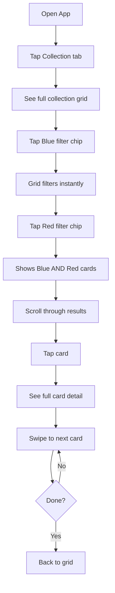

# UX Design Specification mtg

**Author:** Guillaume
**Date:** 2026-01-31

---

## Executive Summary

### Project Vision

mtg is a mobile app that lets Magic: The Gathering players scan physical cards with their phone camera and maintain a digital collection they can browse anywhere. The core value proposition is "point, scan, done" - painless card cataloging that actually gets used, transforming the tedious task of collection management into a seamless experience.

### Target Users

**Primary: The Returning Player**
- Played MTG in youth, returned to the game with adult disposable income
- Rebuilding collection through boosters and precon decks
- Tech-savvy (professional background) but expects the app to "just work"
- Values efficiency - card management should never feel like a chore
- Plays multiple formats (Standard, Commander with friends)

**Secondary: Friends/Fellow Players**
- Same core needs, independent collections
- Mix of iOS and Android users

### Key Design Challenges

1. **Camera-First UX** - The scanning experience IS the product. Must feel instant (<2s), reliable (99%), and satisfying every time
2. **Batch Scanning Flow** - Users scan 14-100+ cards per session. The flow must minimize friction and fatigue across many consecutive scans
3. **Offline-First Browsing** - Collection browsing must feel native and responsive (<1s), not like degraded "cached" data
4. **Filter Discovery** - MTG players think in color/type/mana/set dimensions. Filters must be immediately intuitive and quickly accessible

### Design Opportunities

1. **Zero-Friction Onboarding** - Camera opens on first launch. No signup, no tutorial walls. User scans their first card within 5 seconds of opening the app
2. **Satisfying Scan Feedback** - The moment of card recognition should feel magical through visual confirmation and subtle haptic feedback
3. **Collection as Memory** - Browsing the digital collection should evoke the tactile pleasure of flipping through physical cards

## Core User Experience

### Defining Experience

The core experience of mtg is the **scan**. The app is fundamentally a card scanner that happens to have a collection, not a collection app with scanning bolted on. Every design decision flows from making the camera → recognition → confirmation flow feel instant and magical.

The defining interaction: Point phone at card, see it recognized in under 2 seconds, tap once to add. If this feels magical, everything else is just organization around that magic moment.

### Platform Strategy

| Aspect | Decision |
|--------|----------|
| Platform | Mobile app (Flutter cross-platform) |
| Primary Target | iOS - touch-first, camera-native |
| Secondary Target | Android - identical experience for friends |
| Input Model | Touch + Camera (no keyboard for core flows) |
| Offline Capability | Full browsing/filtering offline; scanning requires network |
| Device Features | Camera, haptic feedback, local storage |

### Effortless Interactions

**Zero-thought actions:**
1. **Starting a scan** - Open app → camera ready (one tap maximum)
2. **Adding a card** - Recognition appears → single tap to confirm
3. **Continuing to scan** - After adding, immediately ready for next card
4. **Finding a card** - Type name or tap filter, results appear instantly

**Friction points eliminated:** Excessive taps, slow recognition, clunky batch flows, filters buried in menus.

### Critical Success Moments

| Moment | Success Indicator |
|--------|-------------------|
| First scan | "It recognized it instantly" - trust established |
| Batch completion | 14 cards scanned in under 2 minutes - efficiency proven |
| Subway browse | Finding forgotten cards - collection value realized |
| Duplicate detection | Informed but not blocked - respects user intent |

**Make-or-break threshold:** The first 3 scans. Flawless execution here establishes permanent trust.

### Experience Principles

1. **Camera-First** - The app is a scanner that happens to have a collection, not a collection app with scanning
2. **Instant Feedback** - Every action gets immediate visual/haptic response. No loading spinners for core flows
3. **Flow State Scanning** - Batch scanning should feel rhythmic and satisfying, not repetitive and tedious
4. **Offline Confidence** - Browsing never feels degraded or "cached" - it's your collection, always available

## Desired Emotional Response

### Primary Emotional Goals

| Moment | Target Emotion |
|--------|----------------|
| First scan works | **Delight** + **Trust** - "This actually works!" |
| Batch scanning | **Flow** + **Satisfaction** - Rhythmic, almost meditative |
| Browsing collection | **Pride** + **Nostalgia** - "Look at what I've collected" |
| Finding forgotten card | **Discovery** + **Excitement** - "Oh! I forgot I had this!" |

The emotion that makes users tell a friend: "You won't believe how fast this thing scans cards."

### Emotional Journey Mapping

| Stage | Desired Feeling |
|-------|-----------------|
| First launch | Curiosity → Instant confidence (camera appears, no barriers) |
| First scan | Anticipation → Delight (it worked!) |
| During batch | Focus → Flow state (scan-tap-scan rhythm) |
| Session end | Accomplishment ("14 cards added!") |
| Returning | Familiarity → Trust (it's all still there) |
| Error state | Understanding, not frustration (clear error, easy retry) |

### Micro-Emotions

**Cultivate:**
- **Confidence** - "I know this will work"
- **Trust** - "My collection is safe"
- **Accomplishment** - "Look what I cataloged"
- **Delight** - "That was satisfying"

**Prevent:**
- Anxiety - "Will it recognize it?"
- Skepticism - "Is this accurate?"
- Frustration - "This is taking forever"
- Boredom - "Same old thing"

### Design Implications

| Target Emotion | UX Design Approach |
|----------------|-------------------|
| Delight | Haptic feedback on recognition, smooth animations, satisfying "add" confirmation |
| Trust | High accuracy (99%), card image proof, consistent behavior |
| Flow | Minimal taps, auto-ready for next scan, no interruptions |
| Confidence | Offline works perfectly, data always there, clear status indicators |
| Discovery | Grid browsing invites exploration, filters reveal forgotten cards |

### Emotional Design Principles

1. **Reward Every Scan** - Each successful recognition should feel like a small win through visual and haptic feedback
2. **Never Break Trust** - Accuracy and data persistence are emotional requirements, not just technical ones
3. **Embrace the Rhythm** - Batch scanning should feel satisfying, not tedious
4. **Celebrate Progress** - Session summaries and collection counts reinforce accomplishment

## UX Pattern Analysis & Inspiration

### Inspiring Products Analysis

Patterns drawn from successful apps in related categories:

**Camera/Scanning Apps (document scanners, QR readers):**
- Instant viewfinder ready on launch
- Frame guides showing positioning
- Visual recognition feedback (pulse/highlight)
- Haptic confirmation on success

**Collection/Inventory Apps (photo galleries, shopping):**
- Grid-first visual browsing
- Sticky, always-accessible filter bar
- Swipe navigation between items in detail view

**Batch/Productivity Apps (todo, note-taking):**
- Running counter during session
- Satisfying session summaries
- Easy undo for mistakes

### Transferable UX Patterns

| Pattern | Source | Application to mtg |
|---------|--------|-------------------|
| Camera-ready launch | Scanner apps | First scan in 5 seconds |
| Frame overlay | Document scanners | Guide card positioning |
| Haptic + visual confirmation | Payment apps | Satisfying scan feedback |
| Grid with sticky filters | E-commerce | Collection browsing |
| Filter chips | Shopping apps | Color/type/mana/set filters |
| Swipe between items | Photo galleries | Card detail navigation |
| Session summary | Fitness apps | Batch completion feedback |

### Anti-Patterns to Avoid

| Anti-Pattern | Why It Fails for mtg |
|--------------|---------------------|
| Tutorial walls on first launch | Breaks "first scan in 5 seconds" goal |
| Confirmation dialogs ("Are you sure?") | Kills batch scanning flow |
| Hamburger menus for filters | Hides discoverability, adds taps |
| Loading spinners on browse | Breaks offline confidence |
| Mandatory account creation | Zero value for single-user MVP |
| Modal interruptions during batch | Destroys flow state |

### Design Inspiration Strategy

**Adopt Directly:**
- Camera viewfinder ready on launch
- Grid browsing with visible filter bar
- Haptic + visual feedback on successful scan
- Session summaries with card count

**Adapt for MTG:**
- E-commerce filter chips → MTG dimensions (color, type, mana cost, set)
- Photo gallery swipe → Card-to-card navigation in detail view
- Shopping cart counter → "Cards scanned this session" counter

**Strictly Avoid:**
- Any friction before first scan (no onboarding, no signup)
- Modal dialogs during batch scanning
- Hidden navigation requiring discovery
- Loading states for local data

## Design System Foundation

### Design System Choice

**Material Design 3 (Material You)** - Flutter's native design system

### Rationale for Selection

| Factor | How Material 3 Fits |
|--------|---------------------|
| Platform | Native to Flutter, works seamlessly on iOS and Android |
| Development Speed | Zero setup, complete component library included |
| Learning Curve | Extensive documentation, massive community |
| Component Coverage | Cards, grids, filter chips, FABs, bottom sheets - all needed components exist |
| Accessibility | Built-in a11y support |
| Theming | Full customization via color schemes and tokens |

### Implementation Approach

**Use Material 3 defaults with targeted customization:**

1. **Core Components (use as-is):**
   - Bottom navigation bar
   - Filter chips for color/type/mana/set
   - Cards for collection grid items
   - Search bar
   - FAB for scan action
   - Snackbars for feedback

2. **Custom Components (build within Material shell):**
   - Camera viewfinder with card frame overlay
   - Scan result confirmation card
   - Card detail image viewer

### Customization Strategy

**Color Scheme:**
- Dark theme as default (matches MTG aesthetic, easier on eyes during long browse sessions)
- Accent colors inspired by MTG mana colors for visual interest
- High contrast for card text readability

**Typography:**
- Material 3 default type scale
- Card names prominent, metadata secondary

**Component Styling:**
- Collection grid cards: Rounded corners, subtle elevation
- Filter chips: MTG color-coded (white, blue, black, red, green)
- Scan button: Prominent FAB, always accessible

## Defining Experience

### The Core Interaction

**"Point at card → it's recognized → tap to add"**

This is what users will tell their friends: "You just point your phone at the card and it knows what it is."

### User Mental Model

**Current solutions users know:**
- Manual spreadsheet entry (tedious, abandoned)
- Physical binder organization (no digital access)
- Memory (unreliable)
- Not tracking at all (most common default)

**Mental model brought to the app:**
- "Scanning" = like QR codes or document scanners
- Expectation: point → instant result
- Delay tolerance: very low (Shazam has trained users to expect magic)

**Frustration triggers:**
- Recognition taking more than 2 seconds
- Needing to manually position perfectly
- Wrong card recognized
- Can't immediately scan the next card

### Success Criteria

| Criteria | Target |
|----------|--------|
| Recognition speed | < 2 seconds from stable frame |
| Accuracy | 99%+ correct identification |
| Taps to add | 1 (single confirmation tap) |
| Ready for next | Immediate (no navigation required) |
| Visual feedback | Card name overlaid on viewfinder |
| Haptic feedback | Subtle vibration on recognition |

### Pattern Strategy

**Established patterns adopted:**
- Camera viewfinder (universal mobile pattern)
- Tap to confirm (standard interaction)
- Overlay results on camera view (AR-style, familiar from QR scanners)

**Unique innovations:**
- Continuous scanning mode (like retail barcode scanners)
- Session awareness ("14 cards added this session")
- Duplicate intelligence ("You have 3 of these" - informs, doesn't block)

### Experience Mechanics

**Initiation:**
- Open app → camera viewfinder appears immediately
- Card frame overlay subtly guides positioning
- No explicit "start scan" button required

**Interaction:**
- Hold phone over card (~6-12 inches distance)
- System auto-detects stable, readable card
- OCR extracts name → Scryfall lookup automatic

**Feedback:**
- Success: Card name + set overlay + haptic pulse
- Duplicate: "You have 3" badge appears
- Error: "Couldn't recognize - try better lighting" with easy retry

**Completion:**
- Tap card overlay to add to collection
- Brief "Added!" confirmation animation
- Viewfinder immediately ready for next card
- Session counter increments visibly

## Visual Design Foundation

### Color System

**Theme: Dark Mode Default**

| Role | Color | Usage |
|------|-------|-------|
| Background | `#121212` | Main app background |
| Surface | `#1E1E1E` | Cards, sheets, elevated surfaces |
| Surface Variant | `#2C2C2C` | Secondary surfaces, input fields |
| On Background | `#FFFFFF` | Primary text |
| On Surface | `#E0E0E0` | Secondary text |

**MTG Mana Accent Colors:**

| Mana | Color | Hex |
|------|-------|-----|
| White | Warm cream | `#F9FAF4` |
| Blue | Ocean blue | `#0E68AB` |
| Black | Deep purple-black | `#3D3D3D` |
| Red | Fire red | `#D32029` |
| Green | Forest green | `#00733E` |
| Colorless | Gray | `#9E9E9E` |
| Multicolor | Gold | `#C9A227` |

**Semantic Colors:**

| Role | Color | Usage |
|------|-------|-------|
| Primary | `#6750A4` | Main actions, FAB |
| Success | `#4CAF50` | Scan confirmed, card added |
| Error | `#CF6679` | Recognition failed |
| Warning | `#FFB74D` | Duplicate detected |

### Typography System

**Material 3 Type Scale:**

| Style | Usage |
|-------|-------|
| Headline Large | Screen titles ("Collection", "Scan") |
| Title Medium | Card names in grid |
| Body Medium | Card metadata, filter labels |
| Label Small | Quantity badges ("4x"), timestamps |

**Font:** System default (Roboto/SF Pro) - no custom fonts for MVP.

### Spacing & Layout Foundation

**Base Unit:** 8px (Material standard)

| Spacing | Value | Usage |
|---------|-------|-------|
| xs | 4px | Tight spacing (badge padding) |
| sm | 8px | Default component padding |
| md | 16px | Section spacing |
| lg | 24px | Screen padding |
| xl | 32px | Large separations |

**Grid Layout:**
- Collection: 2-column grid (portrait), 3-column (landscape)
- Card aspect ratio: ~63:88 (standard MTG card)
- Gutters: 8px between cards

### Accessibility Considerations

- **Contrast:** All text meets WCAG AA (4.5:1 minimum)
- **Touch targets:** Minimum 48x48dp for interactive elements
- **Font scaling:** Respects system font size preferences
- **Color:** Never use color alone to convey information

## Design Direction

### Chosen Direction: "Dark Scanner"

Clean, dark, focused. The app feels like a professional tool, not a toy. Camera-first with minimal navigation.

### Screen Layouts

**Scan Screen (Primary):**
- Full-screen camera viewfinder
- Card frame overlay guides positioning
- Session counter in header ("14 cards")
- Subtle instruction text at bottom
- Bottom navigation always visible

**Collection Screen:**
- Header with title, search icon, total count
- Horizontal scrollable color filter chips
- 2-column card grid (portrait), 3-column (landscape)
- Quantity badges on cards ("4x")
- Bottom navigation

**Card Detail Screen:**
- Back button + card name header
- Large card image (full width)
- Metadata row: type, mana cost, set
- Quantity owned

### Navigation Structure

**Bottom Navigation Bar (2 tabs):**

| Tab | Icon | Destination |
|-----|------|-------------|
| Scan | Camera | Camera viewfinder |
| Collection | Grid | Collection browser |

**App opens to:** Scan screen (camera-first)

### Component Mapping

| UI Element | Material 3 Component |
|------------|---------------------|
| Main navigation | BottomNavigationBar |
| Color filters | FilterChip (scrollable row) |
| Type/mana/set filters | FilterChip |
| Collection items | Card with Image |
| Quantity indicator | Badge overlay |
| Search | SearchBar (expandable) |
| Confirmations | SnackBar |
| Scan result | BottomSheet or overlay Card |

### Design Rationale

1. **Two-tab navigation** - Scanning and browsing are the only two activities; no need for more
2. **Camera as home** - Reinforces "scanner first" philosophy
3. **Sticky filters** - Always visible, not buried in menus
4. **Grid layout** - Cards are visual; grid lets users scan quickly
5. **Dark theme** - Matches MTG aesthetic, reduces eye strain during long browse sessions

## User Journey Flows

### Journey 1: First Booster Scan

**Goal:** Scan 14 cards in under 2 minutes, feel "that was painless"

```mermaid
flowchart TD
    A[Open App] --> B[Camera viewfinder appears]
    B --> C[Point at card]
    C --> D{Card recognized?}
    D -->|Yes < 2s| E[Show card name + set overlay]
    D -->|No| F[Show "Try better lighting"]
    F --> C
    E --> G[User taps to add]
    G --> H[Haptic + "Added!" animation]
    H --> I[Counter: "1 card added"]
    I --> J{More cards?}
    J -->|Yes| C
    J -->|No| K[User taps Collection tab]
    K --> L[Session summary: "14 cards added"]
```

**Key Decisions:**
- No "start scan" button - camera auto-detects
- Recognition overlay appears ON the viewfinder
- Single tap to confirm
- Counter visible throughout session

### Journey 2: Subway Browse

**Goal:** Find blue/red cards while offline, discover forgotten cards



**Key Decisions:**
- Filters are additive (multi-select)
- Filter response < 1 second
- Swipe between cards in detail view
- Works fully offline

### Journey 3: Batch Scanning

**Goal:** Scan 100+ cards efficiently with duplicate handling

```mermaid
flowchart TD
    A[Open App] --> B[Camera viewfinder]
    B --> C[Scan card]
    C --> D{Already owned?}
    D -->|No| E[Show card overlay]
    D -->|Yes| F[Show "You have 3" badge]
    E --> G[Tap to add]
    F --> G
    G --> H[Counter increments]
    H --> I{More?}
    I -->|Yes| C
    I -->|No| J[View Collection]
    J --> K[Summary: "128 added, Total: 634"]
```

**Key Decisions:**
- Duplicates inform but don't block
- Same flow for new and duplicate cards
- Running counter visible
- Session + total summary on exit

### Journey Patterns

**Navigation:**
- Bottom nav always visible
- Max 2 levels deep (list → detail)
- Back gesture supported

**Feedback:**
- Haptic on successful scan
- Visual overlay on recognition
- Real-time counter updates
- Session summary on completion

**Error Handling:**
- Inline messages (no modals)
- Clear retry actions
- Never blocks the flow

### Flow Optimization Principles

1. **Minimize taps to value** - One tap to add a scanned card
2. **Maintain flow state** - Never interrupt batch scanning
3. **Inform, don't block** - Duplicates show info, don't require decisions
4. **Instant feedback** - Every action acknowledged within 200ms
5. **Graceful degradation** - Offline browsing works perfectly

## Component Strategy

### Design System Components (Material 3)

| Component | Usage in mtg |
|-----------|-------------|
| BottomNavigationBar | Scan / Collection tabs |
| FilterChip | Color, type, mana, set filters |
| Card | Base for collection grid items |
| SearchBar | Card name search |
| SnackBar | "Card added!" confirmations |
| Badge | Quantity indicator ("4x") |
| IconButton | Back, search toggle |
| CircularProgressIndicator | Recognition in progress |

**Coverage:** ~70% of UI needs met by standard Material 3 components.

### Custom Components

**1. CameraViewfinder**
- **Purpose:** Full-screen camera preview for card scanning
- **Content:** Live camera feed with card frame overlay
- **States:** Idle, Scanning, Recognized, Error
- **Accessibility:** "Camera viewfinder, point at card to scan"
- **Implementation:** `camera` package + CustomPainter

**2. CardFrameOverlay**
- **Purpose:** Guide card positioning in viewfinder
- **Content:** Rounded rectangle outline (63:88 MTG ratio)
- **States:** Default (white outline), Recognized (green pulse)
- **Behavior:** Subtle animation pulse when card detected

**3. ScanResultOverlay**
- **Purpose:** Display recognized card over camera view
- **Content:** Card name, set code, duplicate badge
- **States:** New card view, Duplicate card view (shows "You have X")
- **Actions:** Tap anywhere to add to collection
- **Behavior:** Semi-transparent background, appears over viewfinder

**4. CollectionGridCard**
- **Purpose:** Display card thumbnail in collection grid
- **Content:** Card image + quantity badge overlay
- **States:** Default, Loading placeholder, Tap feedback
- **Actions:** Tap to open detail view
- **Size:** 63:88 aspect ratio (standard MTG card)

**5. CardDetailViewer**
- **Purpose:** Full-screen card examination
- **Content:** Large card image, name, type line, mana cost, set, quantity
- **Actions:** Swipe left/right for navigation between cards
- **Implementation:** PageView with custom card layout

### Component Implementation Strategy

**Foundation Approach:**
- All custom components use Material 3 theme tokens
- Colors, typography, spacing from established design system
- Consistent with Material interaction patterns (ripples, elevation)

**Build Strategy:**
- Compose from Flutter primitives + Material widgets
- No external UI component libraries needed
- Camera integration via official `camera` package

### Implementation Roadmap

**Phase 1 - Core (MVP Critical):**
- CameraViewfinder - enables scanning
- ScanResultOverlay - enables card confirmation
- CollectionGridCard - enables browsing

**Phase 2 - Complete:**
- CardFrameOverlay - improves scan UX
- CardDetailViewer - enables full card view

**Phase 3 - Polish:**
- Animation refinements
- Gesture enhancements (pinch-to-zoom)

## UX Consistency Patterns

### Feedback Patterns

**Scan Success:**
| Element | Behavior |
|---------|----------|
| Visual | Card name + set overlay appears on viewfinder |
| Haptic | Short vibration pulse (50ms) |
| Audio | None (silent operation) |
| Duration | Overlay persists until user taps or scans next |

**Scan Error:**
| Element | Behavior |
|---------|----------|
| Visual | Red-tinted overlay with message: "Couldn't recognize card" |
| Secondary | Suggestion text: "Try better lighting or angle" |
| Action | Auto-retry continues (no tap needed) |
| Haptic | Double short pulse (error pattern) |

**Duplicate Detection:**
| Element | Behavior |
|---------|----------|
| Visual | Yellow/gold badge: "You have 3" |
| Behavior | Informs but does NOT block adding |
| Position | Badge appears on scan result overlay |

**Offline State:**
| Context | Behavior |
|---------|----------|
| Browsing | Works fully - no indication needed |
| Scanning | Show banner: "Scanning requires internet" |
| Return to online | No notification - silently works again |

### Loading & Empty States

**Collection Loading:**
- Skeleton grid cards (shimmer effect) while loading
- Maximum 500ms - feel instant

**Empty Collection:**
- Centered illustration of a card stack
- Text: "Your collection is empty"
- Prominent CTA: "Scan your first card"

**Empty Filter Results:**
- Text: "No cards match your filters"
- Action: "Clear filters" link

**Scan Processing:**
- Subtle pulsing animation on card frame overlay
- No blocking spinner - viewfinder stays active
- Recognition happens in < 2 seconds

### Navigation Patterns

**Tab Navigation:**
- Bottom bar with 2 tabs (Scan, Collection)
- Active tab: Filled icon + label
- Inactive tab: Outline icon, no label
- Tab tap: Navigate to screen root

**Detail Navigation:**
- Back button (top-left) returns to previous screen
- Swipe-from-edge gesture for back navigation
- Swipe left/right in card detail to navigate between cards

**State Preservation:**
- Filter selections persist when navigating away and back
- Scroll position preserved on return to collection
- Scan session counter persists until app backgrounded for 5+ minutes

### Action Patterns

**Button Hierarchy:**

| Type | Usage | Style |
|------|-------|-------|
| Primary | Main action per screen | Filled, primary color |
| Secondary | Alternative actions | Outlined |
| Tertiary | Low-priority actions | Text only |

**mtg-specific Actions:**
- **Add to Collection** - Single tap anywhere on scan result overlay
- **Clear Filters** - Text button in filter bar
- **Search** - Tap search icon to expand search bar

**Destructive Actions:**
- Not present in MVP (no delete functionality)
- Future: Swipe-to-delete with undo SnackBar

### Form Patterns

**Search Input:**
- Expandable from icon in header
- Clear button appears when text entered
- Results filter as user types (debounced 300ms)
- Keyboard dismisses on scroll

**Filter Selection:**
- Multi-select chips (toggle on/off)
- Selected state: Filled chip with checkmark
- Clear all: Text button at end of filter row

## Responsive Design & Accessibility

### Responsive Strategy

**Mobile-Only Approach:**
mtg is a mobile-first, mobile-only application. Responsive design focuses on device variations within mobile platforms rather than traditional desktop/tablet/mobile breakpoints.

**Device Considerations:**

| Device Type | Screen Range | Adaptations |
|-------------|--------------|-------------|
| Small phones | 320-375px width | Single-column grid option, compact filters |
| Standard phones | 376-428px width | 2-column collection grid (default) |
| Large phones/phablets | 429px+ width | 2-column with larger card thumbnails |
| Landscape orientation | Any width | 3-column grid, horizontal filter scroll |

**Layout Adaptations:**

| Screen | Portrait | Landscape |
|--------|----------|-----------|
| Scan | Full viewfinder, bottom nav visible | Full viewfinder, controls repositioned |
| Collection | 2-column grid | 3-column grid |
| Card Detail | Full-width image, metadata below | Split view: image left, metadata right |

### Breakpoint Strategy

**Mobile Breakpoints:**

| Breakpoint | Width | Characteristics |
|------------|-------|-----------------|
| Compact | < 360px | Small phones, accessibility zoom enabled |
| Standard | 360-414px | Most modern phones (target) |
| Expanded | > 414px | Large phones, landscape mode |

**Flutter Implementation:**
- Use `LayoutBuilder` for component-level adaptations
- Use `MediaQuery.sizeOf(context)` for screen-level decisions
- Prefer flexible layouts over fixed breakpoint logic
- Test with system font scaling at 100%, 150%, 200%

### Accessibility Strategy

**WCAG Compliance Level:** AA (recommended industry standard)

| Requirement | Target | Implementation |
|-------------|--------|----------------|
| Color Contrast | 4.5:1 minimum | Dark theme with white/light text (compliant) |
| Touch Targets | 48x48dp minimum | All buttons, chips, and interactive elements |
| Font Scaling | Up to 200% | Layouts adapt to system font preferences |
| Screen Readers | Full support | VoiceOver (iOS) and TalkBack (Android) |
| Motion | Reducible | Respect "reduce motion" system setting |

**Camera Accessibility:**
- Screen reader announces: "Camera viewfinder active. Point at card to scan."
- Haptic and optional audio feedback for scan results
- High-contrast card frame overlay option
- Voice announcement of recognized card name

**Collection Accessibility:**
- List view alternative for screen reader users (more sequential)
- Card names announced on focus
- Filter state changes announced
- Clear semantic structure for navigation

**Color Blindness Considerations:**
- MTG mana colors supplemented with icons/symbols
- Never rely on color alone to convey filter state
- Selected chips show checkmark in addition to fill color

### Testing Strategy

**Device Testing Matrix:**

| Platform | Devices |
|----------|---------|
| iOS | iPhone SE (small), iPhone 15 (standard), iPhone 15 Plus (large) |
| Android | Pixel 7a (standard), Samsung Galaxy S24 Ultra (large) |

**Accessibility Testing:**
- VoiceOver navigation through all user journeys
- TalkBack navigation through all user journeys
- Switch control compatibility (iOS)
- Keyboard/D-pad navigation (external keyboards)
- Color blindness simulation for MTG mana filter chips

**Font Scaling Testing:**
- Test all screens at 100%, 150%, 200% system font size
- Verify layouts don't break with large fonts
- Ensure touch targets remain accessible

### Implementation Guidelines

**Responsive Development:**
```dart
// Use Flexible/Expanded for adaptive layouts
Row(
  children: [
    Expanded(child: FilterChips()),
  ],
)

// Use LayoutBuilder for component adaptations
LayoutBuilder(
  builder: (context, constraints) {
    final columns = constraints.maxWidth > 500 ? 3 : 2;
    return GridView.count(crossAxisCount: columns, ...);
  },
)
```

**Accessibility Development:**
```dart
// Semantic labels for custom widgets
Semantics(
  label: 'Lightning Bolt, you own 4 copies',
  child: CollectionGridCard(...),
)

// Minimum touch targets
SizedBox(
  width: 48,
  height: 48,
  child: IconButton(...),
)
```

**Key Implementation Rules:**
1. All interactive elements minimum 48x48dp
2. All text uses theme-based sizing (respects system scale)
3. Custom widgets include `Semantics` wrappers
4. Animations check `MediaQuery.disableAnimations`
5. Images include `semanticLabel` for screen readers
